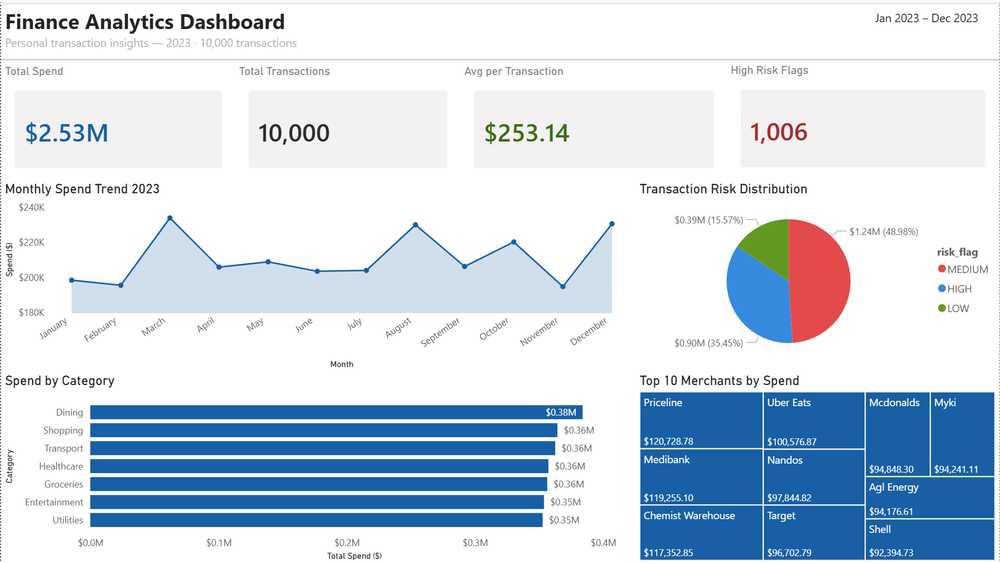

# finance-analytics-pipeline
An end-to-end data pipeline that ingests 10,000+ banking transactions, cleans and transforms the data using Python and pandas, stores it in SQL, and visualises spending trends in Power BI — mimicking a real bank's internal analytics workflow.

# 💰 Finance Analytics Pipeline

## Overview
End-to-end data pipeline that processes 10,000+ banking transactions,
transforms and stores them in SQL Server, and visualises trends in Power BI.

## Tech Stack
- Python (pandas, sqlalchemy, pyodbc)
- SQL Server
- Power BI

## Pipeline Architecture
CSV → Python (clean + transform) → SQL Server → Power BI

## Key Features
- Automated data ingestion and transformation
- Spending category classification
- Monthly trend analysis and anomaly flagging

## Dashboard Preview

## How to Run
1. Clone the repo
2. Run scripts in order: 01 → 02 → 03
3. Open Power BI file and refresh data source